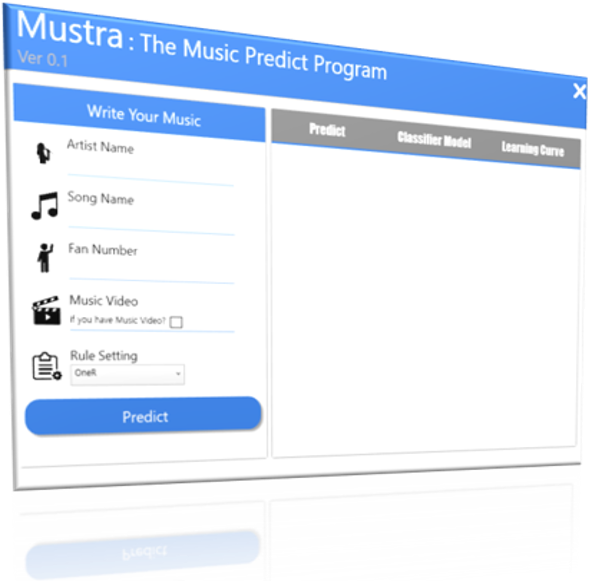

{: .lead}
<!–-break-–>

Mustra
===

Skill Set & Reference
---

What is Mustra
---

Mustra는 국내 음원 차트제공 플랫폼인 Melon의 좋아요 순위를 예측하기 위한 프로그램입니다.

현재 Release 된 버전은 **Mustra Ver0.1** 이며, 현재 Microsoft Azure의 Hyper-V 위에서 동작하고 있는 server에 연결되어 있습니다.

How to Running this?
---

Weka 3-8 Machine Learning Program을 사용하여, 

해당 곡의 정보에 대해 다음과 같은 속성들을 기준으로 순위를 예측하기 위한 Knowledge Base를 생성 합니다.

DataSet
---

본 프로그램의 Knowledge Base를 구성한 Dataset은 

2019년도 11월 Melon 최신 음악 리스트에 대해, 

아래에 소개해 드릴 속성에 대한 정보를 Web에서 Crawl, Scrapping 하여 구성되었습니다.

Attributes
---

본 DataSet의 Attribute는 다음과 같습니다.

| Attribute Name| Name| Value
|:---------------:|:------:|:-----:|
| ASR | 가수 검색 결과 수 | Numeric
| ASSR | 가수 + 노래 검색 결과 수 | Numeric
| ASSNR | 가수 + 노래 기사 수 | Numeric
| Video | 뮤직 비디오 유/무 | Nominal (Yes or No)
| FanNum | 멜론 팬 수 | Numeric
| LikeC(**Class**) | 좋아요 수 | Nominal (A,B,C,D)

